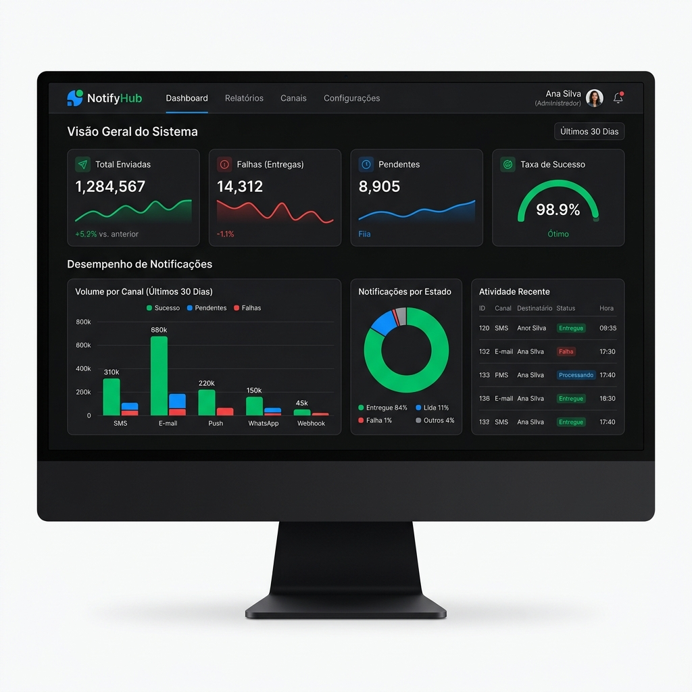
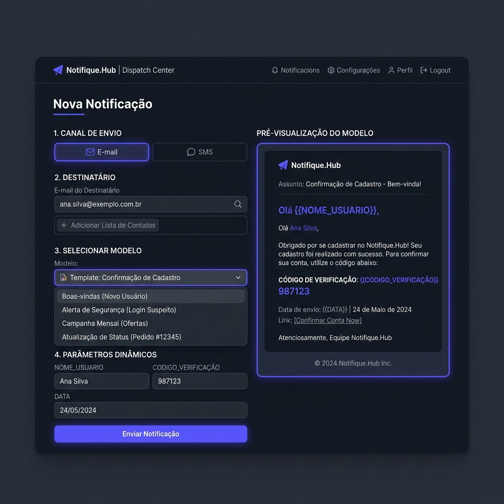

## NotifyHub
NotifyHub é uma aplicação moderna e robusta para disparo e rastreamento de notificações (e-mail e SMS) com processamento assíncrono via fila de mensagens (JMS/ActiveMQ). O sistema conta com suporte a templates dinâmicos com variáveis customizáveis, histórico de auditoria completo (Audit Trail) para rastrear cada mudança de estado da mensagem e um painel de monitoramento integrado.

### Você também pode verificar o mockup / rotas locais
- Frontend Web App: http://localhost:5173/
- Swagger UI (API Docs): http://localhost:8080/swagger-ui/index.html
- Console de Administração ActiveMQ: http://localhost:8161/
- pgAdmin (Gerenciador do Banco): http://localhost:5050/

## Tecnologia 

Aqui estão as tecnologias utilizadas neste projeto:

* Java versão 21
* Spring Boot versão 3.3.x
* React versão 19
* Vite versão 8
* Tailwind CSS versão 4
* ActiveMQ Classic
* Docker 
* Docker Compose
* PostgreSQL 16
* Flyway Migrations

## Serviços Utilizados

* Github
* ActiveMQ Console
* pgAdmin 4

## Bibliotecas / Depedências (Spring Starter & NPM)

* Spring Boot Starter ActiveMQ (Mensageria)
* Spring Boot Starter Data JPA (Persistência)
* Spring Boot Starter Validation (Validação)
* MapStruct 1.6.3 (Mapeamento DTO/Entidade)
* SpringDoc OpenAPI 2.8.8 (Documentação Swagger)
* React Query / TanStack (Gerenciamento de Estado/Cache)
* Recharts (Gráficos Interativos)
* Axios (Consumo de API REST)
* Lucide React (Ícones Modernos)

## Como começar (Getting started)

* Dependências
  - Docker
  - Docker Compose
  - Java 21 (Para rodar o backend localmente)
  - Node.js & npm (Para rodar o frontend localmente)

* Para construir e iniciar os containers de infraestrutura (Banco e Fila):
>    $ docker compose up -d

* Para rodar as migrations do Flyway e iniciar o backend:
>    $ ./mvnw spring-boot:run

* Para instalar as dependências do frontend:
>    $ cd frontend
>    $ npm install

* Para rodar o projeto frontend:
>    $ npm run dev

 - Página Inicial (Painel Geral / Dashboard)

- Envio de Mensagens e Pré-visualização Dinâmica de Templates

## Links
  - Repositório: https://github.com/joaovictorlourenco/NotifyHub.git
  - Em caso de bugs sensíveis como vulnerabilidades de segurança, entre em contato diretamente com:
    Lucassiqueiraferandes07@gmail.com. Valorizamos seu esforço em melhorar a segurança deste projeto!

  ## Versão

  1.0.0

  ## Autor

  * **Lucas Siqueira Fernandes** 

  Por favor, siga no GitHub e junte-se a nós!
  Obrigado pela visita e boas linhas de código!
